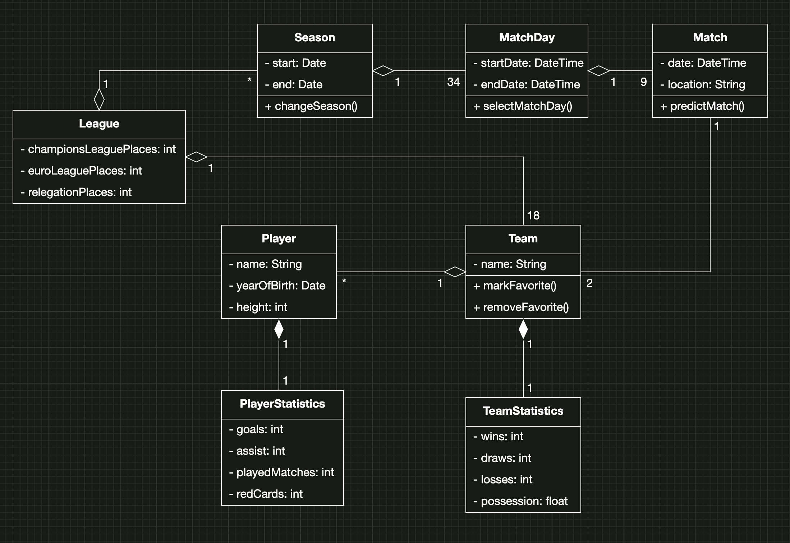
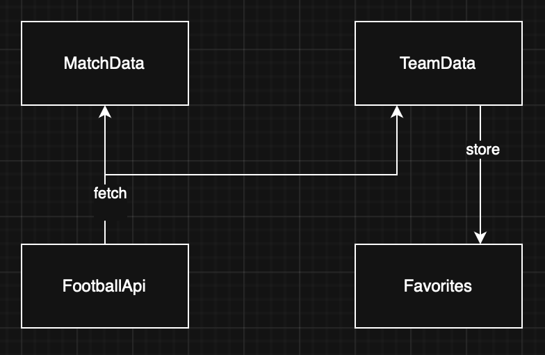
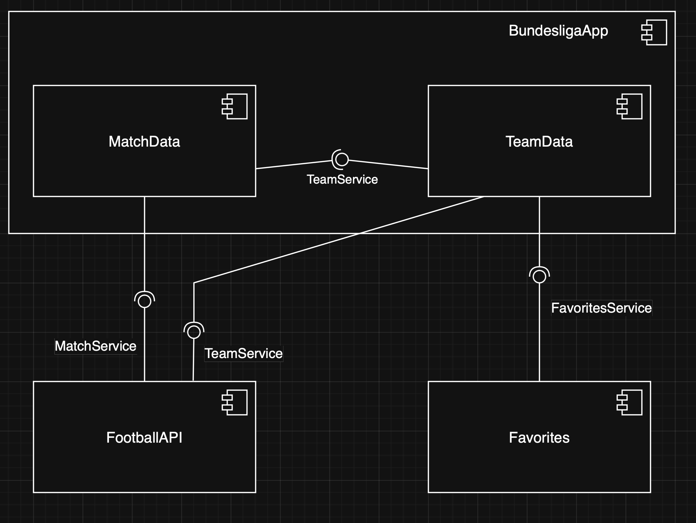

# Intro Course Project App of Kevin Gruber for the iPraktikum

Welcome to your project repository! My name is Kevin and i love Software Engineering! To pass the intro course, you will need to develop a unique iOS app using SwiftUI. There are no limitations on the app’s functionality, so feel free to be as creative as you want. However, your app must meet the provided Non-Functional Requirements (NFRs), which are available on Artemis.

## Submission Procedure

1. **Personal Repository**:  
   You have been given a personal repository on GitLab to work on your app.

2. **Issue-Based Development**:

   - Follow the issue-based development process from the Git Basics session.
   - Create branches directly from issues (Dropdown -> Select "Create branch").

3. **Merge Requests (MR) (sometimes also Pull Requests (PR))**:
   - Once you implement an issue, create a Merge Request to merge your changes from the feature branch into your main branch.
   - Add your tutor as a reviewer and communicate with them. Your tutor will review your changes and either request modifications or approve the MR.
   - It is **your responsibility to merge** the approved MR.

**Deadline**: **16.04.2025 18:00 CET**

**All MRs must be merged by the deadline**, and your final app **must satisfy all** of the requested NFRs. Note that during the first four days, there are also intermediate merge deadlines for software engineering artifacts to help you stay on track with requirements and architecture.

---

## Project Documentation

This README serves as your primary documentation for the project. Update it as your project evolves.

### Problem Statement (max. 500 words)

Bundesliga Statistics App

Many existing football apps tend to be overly complicated, often overwhelming users with distracting information such as blogs, transfer news, and teams that may not be relevant to them.
The goal is to develop a streamlined football app specifically focused on the League. This app will provide users with essential statistics for teams and players, upcoming matches, and an up-to-date League table.By prioritizing relevant and concise information, the app will enhance the user experience for Bundesliga fans and provide a offline view for their favorite team.

### Requirements

#### User Stories

- As a user, I want to see an overview of the League table so that I am always up to date with the current standing
- As a user, I want to see upcoming matches so that i always know, when important matches are played
- As a user, I want to get player informations so that i know how well players are performing
- As a user, I want to get team informations so that i know how well teams are performing
- As a user, I want to see the statistics of my favorite club even without a internet connection, so that i can always stay up to date

#### Glossary (Abbott's Technique)

| Term      | Definition                                                                                                                   |
| :-------- | :--------------------------------------------------------------------------------------------------------------------------- |
| League    | Contains general information about the German Bundesliga, like the league format, and the season duration.                   |
| Season    | Contains all the Match Days from a single year of play, along with the start and end dates.                                  |
| Match     | Holds the statistics of one play, including the two competing teams.                                                         |
| Match Day | Represents one match round, where every Team plays one Match, there are 34 match rounds in total                             |
| Team      | Represents one of the 18 teams in the German Bundesliga, can be marked as a favorite.                                        |
| Player    | Represents one player in a team, including metrics like his personal information, his role in the team, and his performance. |

#### Analysis Object Model

### Architecture

#### Top-Level Architecture

#### Subsystem Decomposition

---

_Remember to replace placeholders and update each section with your project’s details. This document will serve both as your planning guide and as a final piece of documentation for your project._

Happy coding!
